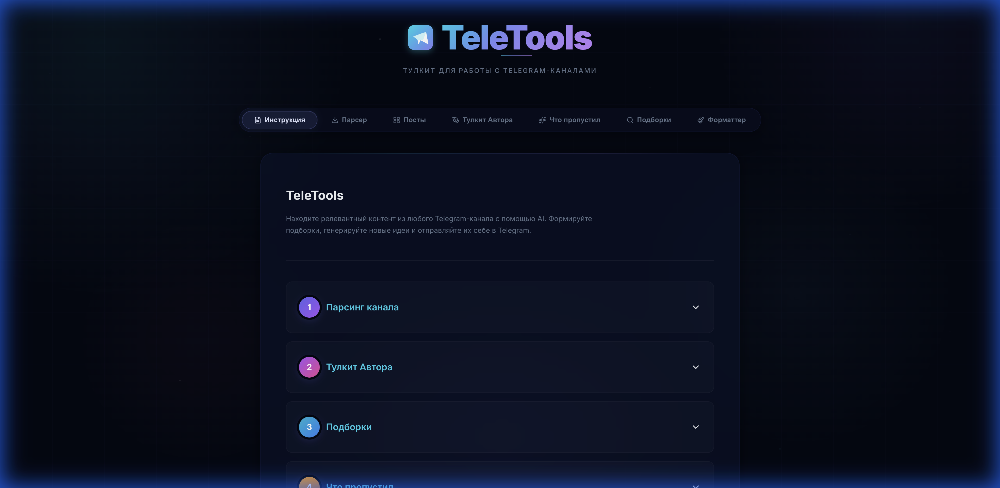

# TeleTools

**TeleTools** — это мощный набор инструментов для работы с Telegram-каналами. Анализируйте контент, находите интересные посты с помощью AI, генерируйте новые идеи и форматируйте сообщения для отправки.



## Возможности

### 1. 📥 Парсер
Загрузка и обработка истории сообщений канала.
- Поддержка экспорта из Telegram Desktop (`messages.html`).
- Извлечение текста, дат и реакций.
- Сохранение в JSON для дальнейшей работы.
- Поддержка различных форматов дат (включая импортированные из HTML-экспорта и полученные напрямую через API-синхронизацию).

### 2. 📊 Посты (View Posts)
Просмотр всей базы постов канала.
- Таблица с сортировкой по **Дате** и **Реакциям**.
- Поиск по тексту поста.
- Быстрый переход к оригиналу.
- **Экспорт в JSON:** возможность открыть и скопировать посты в формате JSON прямо из интерфейса (с фильтрацией по количеству постов).

### 3. ✍️ Тулкит Автора
Инструмент для креаторов.
- **Контекстный поиск**: выберите лучшие посты (сортировка по дате, реакциям, просмотрам, пересылкам).
- **AI Генерация**: попросите Gemini предложить новые темы, переписать пост или сделать саммари на основе выбранных.
- **Настройки**: выбор модели (Gemini 2.0 Flash/Pro/Lite) и температуры креативности.
- **Превью**: удобный просмотр полного текста поста перед выбором.

### 4. ✨ Что пропустил (Missed Posts)
Персонализированная лента обновлений.
- Укажите свои интересы (например, "AI, Python, Startups").
- Выберите период (последние 3, 7, 30 дней).
- AI найдёт самые релевантные посты, которые вы могли пропустить.

### 5. 📋 Дайджест (Digest Builder)
Генерация дайджестов канала за период — через API или копирование промпта в AI Studio.
- Выбор канала, периода (пресеты: неделя/2 недели/месяц или кастом).
- Автоматический поиск прошлого дайджеста и его ссылки.
- Два режима: **Генерация через Gemini API** или **Копирование готового промпта** для вставки в Google AI Studio / ChatGPT / Claude.
- Автоподхват новых постов через Bot API — если бот добавлен админом в канал, все новые посты автоматически попадают в базу.
- **Живая статистика:** просмотры, реакции и пересылки обновляются в реальном времени.
- **Синхронизация:** кнопка «Подтянуть статистику» загружает views/forwards/reactions для ВСЕХ постов (включая старые из HTML-экспорта) через MTProto. Логика обновлений автоматически проверяет наличие пробелов (gaps) в недавней истории (до 300 последних сообщений), докачивая пропущенные посты, и сохраняет их с корректным часовым поясом UTC+00:00 для полной совместимости с фильтрами постов.
- Предпросмотр результата, отправка в Telegram.

### 6. 📞 Саммари звонков (Call Summary)
Генерация структурированных саммари из транскриптов звонков и встреч.
- Вставьте текст транскрипта (MacWhisper, Otter.ai, Zoom и т.д.).
- Получите саммари: участники, ключевые темы, решения, action items.
- Два режима: **Через API** или **Копирование промпта** для AI Studio.
- Отправка результата в Telegram.

### 7. 🔍 Подборки (AI Search / Digests)
Семантический поиск по всей истории канала.
- Задавайте вопросы на естественном языке: *"Найди все посты про инвестиции в крипту"*.
- Получайте список постов с кратким содержанием и ссылками.
- Отправляйте готовую подборку себе в Telegram в один клик.

### 8. 🎨 Форматтер
Инструмент для оформления постов.
- Превращает Markdown (из ChatGPT/Gemini/Claude) в правильный HTML для Telegram.
- Поддерживает **жирный**, *курсив*, [ссылки](url), списки.
- Предпросмотр перед отправкой.

---

## Установка и Запуск

### Предварительные требования
- **Docker**
- **Google API Key** (для AI функций)
- **Telegram Bot Token** (для отправки сообщений)

### 1. Клонирование и настройка

```bash
git clone https://github.com/vladkor97/teletools_ngi.git
cd teletools_ngi
cp .env.example .env
```

### 2. Конфигурация (.env)

Заполните файл `.env`:

```env
TELEGRAM_BOT_TOKEN=ваш_токен_от_BotFather
TELEGRAM_API_ID=ваш_api_id
TELEGRAM_API_HASH=ваш_api_hash
GOOGLE_API_KEY=ваш_ключ_от_AI_Studio
```

- **Bot token:** Напишите [@BotFather](https://t.me/BotFather) команду `/newbot`.
- **API ID / Hash:** Получите на [my.telegram.org](https://my.telegram.org) → API Development Tools. Нужны для синхронизации статистики постов.
- **Google API Key:** Получите ключ в [Google AI Studio](https://aistudio.google.com/apikey).

### 3. Запуск

```bash
docker compose up --build -d
```

Приложение будет доступно по адресу: [http://localhost:5173](http://localhost:5173)

### 4. Подключение бота

1. Найдите своего бота в Telegram.
2. Нажмите **Start** (или отправьте `/start`).
3. Теперь вы можете отправлять себе сообщения из интерфейса TeleTools.

---

## Использование

### Шаг 1: Экспорт данных
1. Откройте канал в **Telegram Desktop**.
2. Три точки (⋮) → **Export chat history**.
3. Формат: **HTML**. Галочки с фото/видео можно снять (нужен только текст).
4. Загрузите файл `messages.html` во вкладке **Парсер**.

### Шаг 2: Работа с контентом
- Используйте **Тулкит Автора** для анализа успешных постов.
- Ищите информацию через **Подборки**.
- Следите за трендами через **Что пропустил**.

---

## Технологический стек

- **Backend**: Python, FastAPI, Pydantic, httpx
- **Frontend**: React, Vite, Lucide React
- **AI**: Google Gemini API
- **Telegram**: Telegram Bot API

---

## Лицензия

MIT
